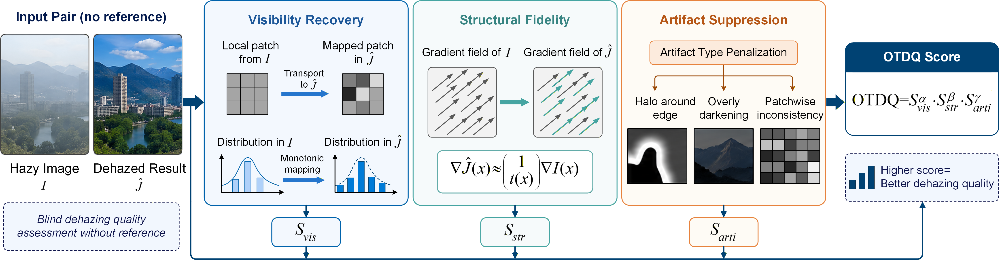
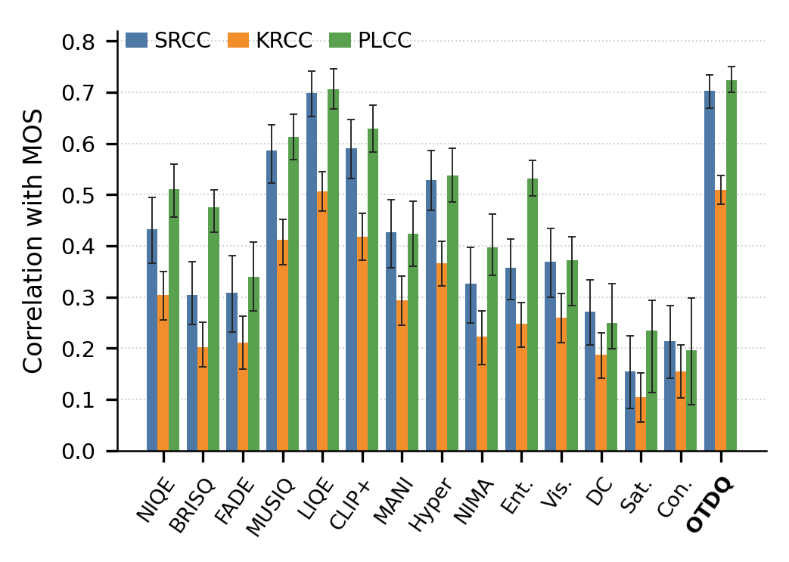
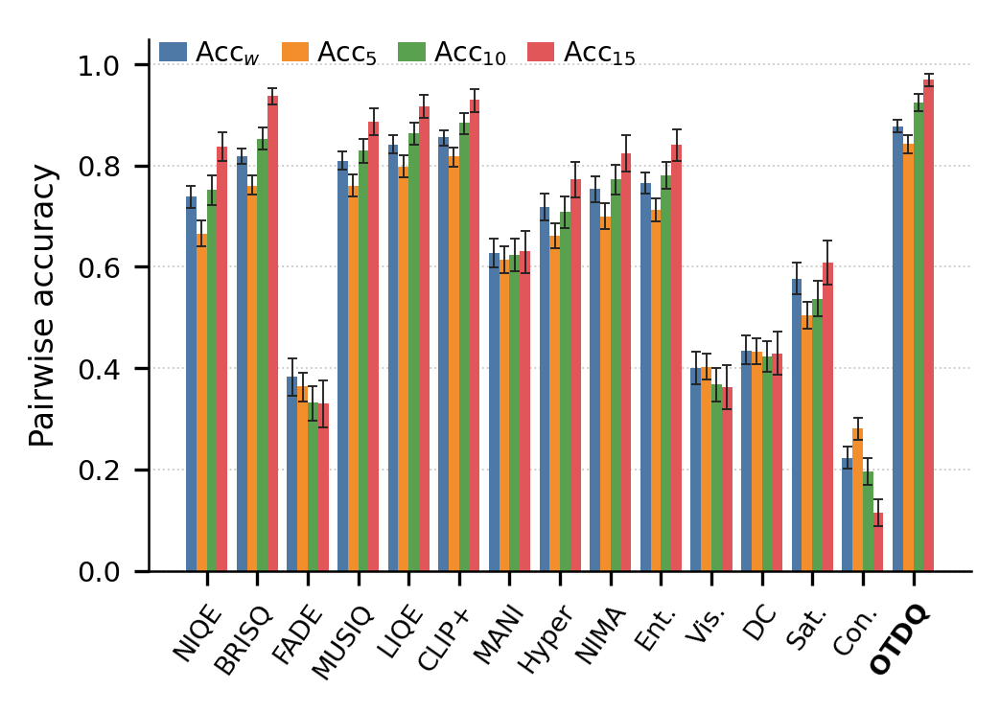

# OTDQ-Eval

Anonymous evaluation toolkit for OTDQ, a no-clear-reference dehazing quality score. OTDQ evaluates a hazy image and a dehazed output without using a clear reference image. The toolkit includes fixed configuration files, scripts for OTDQ/component scoring, DHQ MOS evaluation, paired-benchmark evaluation, pairwise ranking, algorithm-level ranking, bootstrap analysis, and diagnostic figure/table reproduction.

## Repository Layout

```text
.
├── OTDQ.py                         # Standalone core implementation
├── otdq_eval/                      # Importable toolkit package
├── scripts/
│   ├── compute_otdq.py             # OTDQ and component scores
│   ├── evaluate_dhq.py             # DHQ MOS correlations and pairwise preference
│   ├── evaluate_paired_benchmark.py# Paired benchmark scoring and FR consistency
│   ├── pairwise_ranking.py         # Generic within-group pairwise ranking
│   ├── algorithm_ranking.py        # Algorithm-level mean ranking consistency
│   ├── bootstrap_analysis.py       # Group-bootstrap CIs and paired differences
│   ├── reproduce_tables.py         # Configured table reproduction runner
│   └── reproduce_figures.py        # OTDQ diagnostic figure reproduction
├── configs/                        # Fixed JSON configs
├── examples/                       # CSV input templates
├── assets/                         # README figures copied from the paper package
├── requirements.txt
└── pyproject.toml
```

No datasets, dehazing outputs, author information, or local absolute paths are included.

## Method Overview

OTDQ is an input-aware blind dehazing quality metric. It scores a dehazed output together with its hazy input, but does not require a clear reference, MOS label, depth map, transmission map, or learned feature extractor. The main idea is that dehazing should not behave like arbitrary contrast enhancement: under the atmospheric scattering model, a locally valid restoration should induce a regular, approximately monotone affine redistribution from hazy intensities to dehazed intensities while preserving scene structure and avoiding common dehazing artifacts.

The metric reports three normalized component scores:

- `S_vis`: visibility and contrast recovery, based on local quantile/OT affine regularity, a slope factor, and haze-aware dark-channel consistency.
- `S_str`: structural fidelity, based on gradient-direction consistency, local gradient-gain smoothness, and penalties for hallucinated gradients in flat hazy regions.
- `S_arti`: artifact suppression, based on halo, over-darkening, and patchiness detectors.

The final score is a power-weighted geometric fusion:

```text
OTDQ = S_vis^1.00 * S_str^0.50 * S_arti^0.50
```

Higher values indicate stronger agreement with the proposed dehazing-quality criteria.




## Key Experimental Results

The paper evaluates OTDQ on DHQ subjective scores and paired dehazing benchmarks. These results are included here as a compact reference for reproducing the toolkit outputs.

### DHQ Subjective Consistency

DHQ contains 1,750 dehazed samples generated from 250 real hazy images. OTDQ achieves the best point estimates among the compared metrics in global MOS consistency:

| Metric | SRCC ↑ | KRCC ↑ | PLCC ↑ | RMSE ↓ |
|---|---:|---:|---:|---:|
| LIQE, closest baseline | 0.6989 | 0.5062 | 0.7054 | 9.3120 |
| **OTDQ** | **0.7025** | **0.5093** | **0.7251** | **9.0465** |

With 1,000 group-bootstrap resamples, OTDQ obtains:

| Statistic | OTDQ point estimate | 95% bootstrap CI |
|---|---:|---:|
| SRCC ↑ | 0.7025 | [0.6687, 0.7335] |
| KRCC ↑ | 0.5093 | [0.4808, 0.5370] |
| PLCC ↑ | 0.7251 | [0.6995, 0.7496] |
| RMSE ↓ | 9.0465 | [8.6115, 9.4418] |

The pair-aware advantage is clearer for intra-image preference ranking, where dehazed outputs from the same hazy input are compared:

| Metric | Acc_w ↑ | Acc_5 ↑ | Acc_10 ↑ | Acc_15 ↑ |
|---|---:|---:|---:|---:|
| Strongest close baseline | 0.8559 | 0.8177 | 0.8843 | 0.9376 |
| **OTDQ** | **0.8776** | **0.8424** | **0.9248** | **0.9692** |

Paired-bootstrap comparisons report two-sided p-values of 0.018, 0.040, 0.002, and 0.002 for `Acc_w`, `Acc_5`, `Acc_10`, and `Acc_15`, respectively.

<table>
  <tr>
    <td align="center">
      
      <br>
      <sub>Global MOS consistency</sub>
    </td>
    <td align="center">
      
      <br>
      <sub>Intra-image pairwise preference accuracy</sub>
    </td>
  </tr>
</table>

### Paired Benchmark Consistency

For paired benchmarks, the paper uses `RefQ = mean(z(PSNR), z(SSIM), z(-LPIPS))` as a composite full-reference proxy. OTDQ is strongest on SOTS and HSTS, and remains competitive on O-HAZE where real paired acquisition is less perfectly controlled.

Sample-level correlation with RefQ:

| Dataset | SRCC ↑ | KRCC ↑ | PLCC ↑ | Note |
|---|---:|---:|---:|---|
| SOTS outdoor | **0.6883** | **0.5060** | **0.7198** | Best among compared blind metrics |
| HSTS | **0.6026** | **0.4432** | **0.6959** | Best among compared blind metrics |
| O-HAZE | 0.4838 | 0.3351 | 0.4958 | Second-best; CLIPIQA+ is highest |

Intra-image pairwise ranking accuracy against RefQ:

| Dataset | OTDQ Pairwise Acc ↑ | Result |
|---|---:|---|
| SOTS outdoor | **0.7828** | Best |
| HSTS | **0.7686** | Best |
| O-HAZE | 0.6520 | Second-best, close to CLIPIQA+ |

RefQ-based algorithm-level ranking consistency:

| Dataset | Rank-SRCC ↑ | Rank-KRCC ↑ | Top-3 overlap ↑ | NDCG@5 ↑ |
|---|---:|---:|---:|---:|
| SOTS outdoor | **0.804** | **0.657** | **1.000** | **0.941** |
| HSTS | **0.729** | **0.562** | **1.000** | 0.918 |
| O-HAZE | 0.550 | 0.410 | 0.000 | 0.782 |

### Ablation and Efficiency

On DHQ, the full power-weighted fusion achieves the strongest ablation result:

| Fusion | SRCC ↑ | KRCC ↑ | PLCC ↑ | RMSE ↓ |
|---|---:|---:|---:|---:|
| Equal geometric mean | 0.6999 | 0.5027 | 0.7140 | 9.1984 |
| Plain product | 0.6999 | 0.5027 | 0.7137 | 9.2017 |
| **OTDQ full** | **0.7025** | **0.5093** | **0.7251** | **9.0465** |

OTDQ is deterministic, training-free, and CPU-friendly. In the paper experiments, DHQ MOS recomputation over 1,750 pairs took about 22 seconds with 8 CPU workers, and no GPU was required.

## Installation

```bash
python -m venv .venv
source .venv/bin/activate
pip install -r requirements.txt
```

Or install as an editable package:

```bash
pip install -e .
```

## Compute OTDQ

Single pair:

```bash
python scripts/compute_otdq.py \
  --hazy path/to/hazy.png \
  --dehazed path/to/dehazed.png \
  --output outputs/single_otdq.csv
```

Directory mode matches images by stem, then by leading numeric prefix:

```bash
python scripts/compute_otdq.py \
  --hazy-dir data/hazy \
  --dehazed-dir data/dehazed \
  --output outputs/batch_otdq.csv
```

Manifest mode uses a CSV with at least `hazy_path` and `dehazed_path`:

```bash
python scripts/compute_otdq.py \
  --manifest examples/pair_manifest.csv \
  --base-dir . \
  --output outputs/manifest_otdq.csv
```

The CSV written by `scripts/compute_otdq.py` intentionally keeps the compact release columns:

```text
id,hazy_path,dehazed_path,otdq,s_vis,s_str,s_arti
```

Use the Python API or the DHQ/paired evaluation scripts if you need additional diagnostic fields.

## DHQ Evaluation

Expected CSV columns:

- `Haze_name`: hazy image path relative to the DHQ root, or a path under `Haze/`
- `name` or `Dehaze_name`: dehazed image path relative to the DHQ root, or a path under `Dehaze/`
- `MOS_Mean`: subjective quality score
- Optional objective metric columns such as `niqe`, `brisque`, `fade`, `musiq`, `otdq`

Run OTDQ scoring and MOS consistency tables:

```bash
python scripts/evaluate_dhq.py \
  --dhq-csv data/DHQ/comparison.csv \
  --dhq-root data/DHQ \
  --compute-otdq \
  --output-dir outputs/dhq
```

Outputs:

- `dhq_scores_with_otdq.csv`
- `table1_dhq_mos_correlations.csv/.md`
- `table2_dhq_pairwise_preference.csv/.md`

If the CSV already contains `otdq`, omit `--compute-otdq` and `--dhq-root`.

## Paired Benchmark Evaluation

Expected manifest columns:

- `dataset`
- `algorithm`
- `image_id`
- `hazy_path`
- `dehazed_path`
- Optional full-reference columns: `PSNR`, `SSIM`, `LPIPS`

Run:

```bash
python scripts/evaluate_paired_benchmark.py \
  --manifest data/paired_manifest.csv \
  --base-dir . \
  --output-dir outputs/paired
```

When `PSNR`, `SSIM`, and `LPIPS` are present, the script also creates `LPIPS_Q = -LPIPS` and `RefQ`, then writes:

- `paired_scores_with_otdq.csv`
- `table1_sample_level_correlations.csv/.md`
- `table2_pairwise_ranking_accuracy.csv/.md`
- `table3_algorithm_mean_scores.csv/.md`
- `table4_algorithm_level_ranking.csv/.md`

## Ranking and Bootstrap Utilities

Generic pairwise ranking:

```bash
python scripts/pairwise_ranking.py \
  --csv outputs/paired/paired_scores_with_otdq.csv \
  --group-col image_id \
  --metric-cols otdq \
  --reference-cols SSIM RefQ \
  --output outputs/tables/pairwise_ranking.csv
```

Algorithm-level ranking:

```bash
python scripts/algorithm_ranking.py \
  --csv outputs/paired/paired_scores_with_otdq.csv \
  --dataset-col dataset \
  --algorithm-col algorithm \
  --metric-cols otdq \
  --reference-cols PSNR SSIM LPIPS_Q RefQ \
  --output-dir outputs/tables
```

Group bootstrap on DHQ:

```bash
python scripts/bootstrap_analysis.py \
  --csv outputs/dhq/dhq_scores_with_otdq.csv \
  --group-col Haze_name \
  --target-col MOS_Mean \
  --metric-cols otdq niqe brisque fade \
  --output-dir outputs/bootstrap \
  --n-boot 1000
```

The bootstrap unit is the group column, so all dehazed outputs from the same hazy input are resampled together.

## Figure and Table Reproduction

Configured table reproduction:

```bash
python scripts/reproduce_tables.py --config configs/reproduction.json
```

Use `--dry-run` to inspect commands without executing them.

Diagnostic figure reproduction:

```bash
python scripts/reproduce_figures.py \
  --csv outputs/dhq/dhq_scores_with_otdq.csv \
  --image-root data/DHQ \
  --group-col Haze_name \
  --target-col MOS_Mean \
  --score-col otdq \
  --output outputs/figures/fig_otdq_diagnostics.png
```

The figure script selects a high-target and low-target output from the same hazy input, computes OTDQ diagnostics, and exports transport, structure, and artifact heatmaps.

## Python API

```python
from PIL import Image
import numpy as np
from otdq_eval import compute_otdq

hazy = np.asarray(Image.open("hazy.png").convert("RGB"))
dehazed = np.asarray(Image.open("dehazed.png").convert("RGB"))
scores = compute_otdq(hazy, dehazed)
print(scores["otdq"], scores["s_vis"], scores["s_str"], scores["s_arti"])
```

## Fixed OTDQ Configuration

The default fixed configuration is stored in `configs/otdq_default.json`:

```json
{
  "otdq": {
    "min_size": 15,
    "n_q": 1000,
    "var_thresh": 0.0001,
    "flat_alpha": 5.0,
    "window_size": 15,
    "texture_pct": 40.0,
    "halo_pct": 90.0,
    "patch_window": 32,
    "resize_method": "LANCZOS"
  }
}
```

The core fusion follows the implementation in `OTDQ.py`:

```text
OTDQ = S_vis^1.00 * S_str^0.50 * S_arti^0.50
```

## Notes for Anonymous Release

- Keep datasets and generated result folders outside the repository or under ignored `data/` and `outputs/`.
- Do not commit local absolute paths, private dataset links, or author-identifying metadata.
- Add a license file before public release if redistribution terms need to be explicit.
